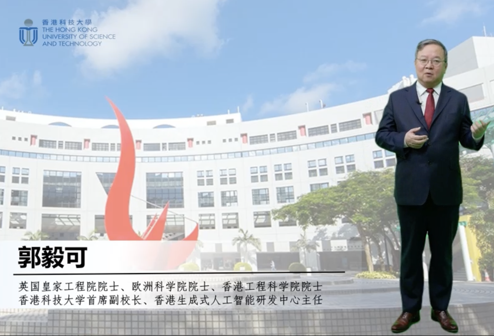
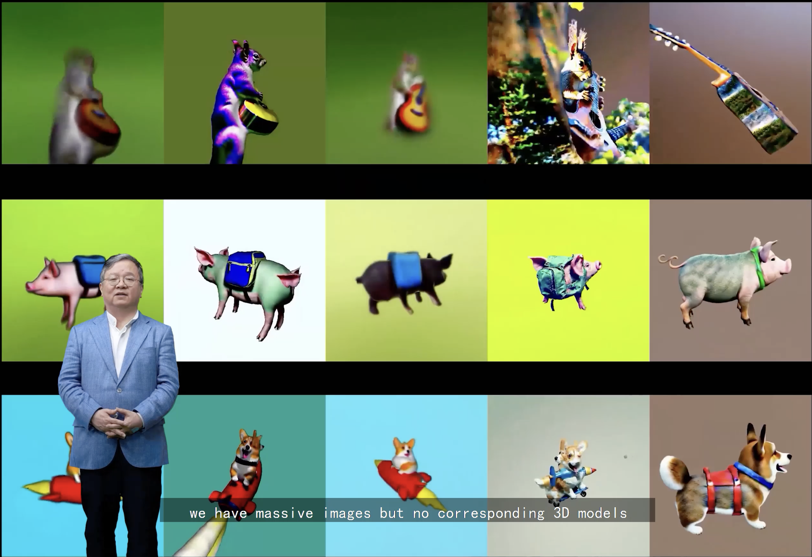
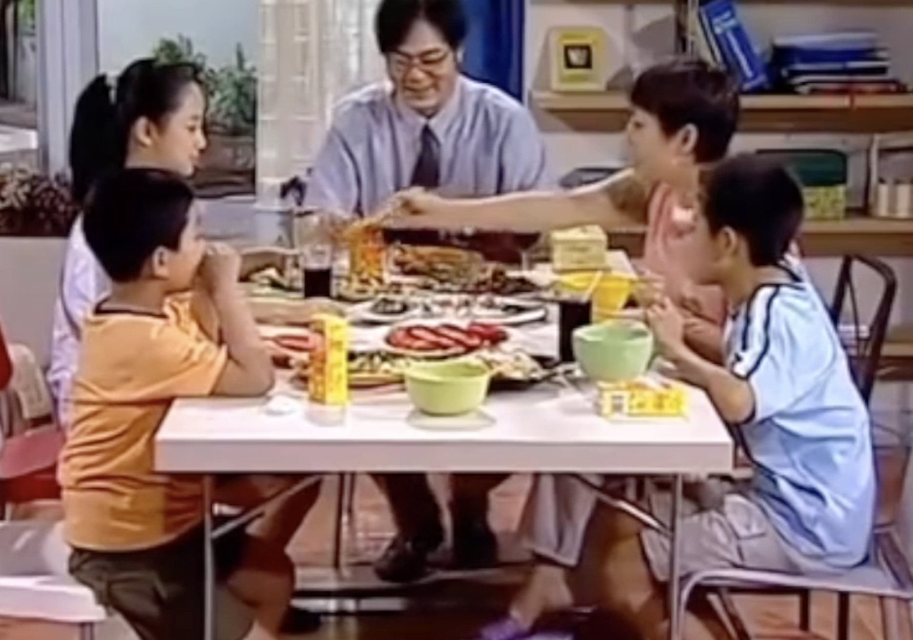

# GPTSOVITS2

## SECTION 1 : Some Demo

### Demo 1: 虚拟人物演讲展示：中关村论坛-数据安全治理与发展论坛
[](https://youtu.be/1Ul04rIBl5I)
### Demo 2: 虚拟人物演讲展示：香港国际创科展-HKGAI展位
[](https://youtu.be/cGw_zqXFHro)
### Demo 3: 多角色影视剧一键翻译
[](https://youtu.be/4GrtZIZ0PHU)

## SECTION 2 : EXECUTIVE SUMMARY / PAPER ABSTRACT

### Project Overview:
This project develops an advanced voice cloning and video synchronization technology that enables users to clone any person's voice and apply it to a video, while adjusting the mouth shape of the person in the video to match the newly generated audio. This technology provides unprecedented flexibility and innovation for creating lifelike videos.

### Technical details:
The project utilizes deep learning algorithms to analyze and clone the characteristics of the target voice, including pitch, rhythm and intonation. The Sound Clone module captures subtle articulation characteristics to produce audio that closely resembles the original recording. In addition, our video processing technology uses precise facial tracking and image processing technology to adjust the mouth shape in the video to ensure accurate audio and video synchronization and enhance visual and auditory consistency.

### Application scenarios:
This technology can be widely used in a variety of scenarios, including film post-production, virtual reality, video games, advertising production, and news reporting. Not only can it be used for entertainment and commercial advertising, it can also reproduce the voices and expressions of specific characters in simulated emergencies or training videos, providing a more realistic interactive experience.

### Innovation:
The innovation of this project is that it combines speech recognition, artificial intelligence synthesis and advanced image processing technology to go beyond simply cloning sounds or editing videos, but to create a comprehensive, multi-modal synchronization system that can operate without Recreate and present any content with the presence of the original audio speaker.

### Future outlook:
With the further improvement and optimization of the technology, we expect this project to promote the development of personalized media content and provide users with a richer and more customized audio-visual experience. In addition, the development of this technology will also promote the establishment and improvement of relevant legal, ethical and privacy protection standards.


## SECTION 3 : CREDITS / PROJECT CONTRIBUTION


| Official Full Name  | Student ID (MTech Applicable)  | Work Items  | Email (Optional) |
| :------------ |:---------------:| :-----| :-----|
| Bian Weizhen  | A0285814W | ALL| E1221626@nus.edu.sg |
| Liu Siyan     | A0285814W | ALL| E1221626@nus.edu.sg |


## SECTION 4 : BUSINESS VIDEO 


## SECTION 5 : USER GUIDE--Voice Clone

### Create the Env:
```
conda create --name gptsovits python=3.10
conda activate gptsovits
```

Note: Using a Conda virtual environment may indeed affect the configuration of environment variables, including the lookup of those library files related to NVIDIA CUDA and cuDNN.

If you encounter the following error and cannot find CUDA or CUDNN, you can solve it with the following code.

Cannot find CUDA:

```
export PATH=/usr/local/cuda/bin:$PATH
export LD_LIBRARY_PATH=/usr/local/cuda/lib64:$LD_LIBRARY_PATH

```

Cannot find CUDNN:
```
conda install cudatoolkit=xx.x cudnn
```

### Install Package

```
conda install -y -c pytorch -c nvidia cudatoolkit
conda install -y -c conda-forge gcc gxx ffmpeg cmake -c pytorch -c nvidia
pip install -r requirements.txt
```

### Train your own Model: Data Preprocessing

If you don't want to train the model yourself, you can jump directly to inference.

#### Step 1: Denoise

Put about 5 minutes of training .wav audio into data/ori. The purpose of this step is noise reduction. Note that you need to prepare a Linux system, other systems are not supported for the time being. If your training audio is of high quality, you can skip this step and go directly to step 2.

```
pip install resemble-enhance --upgrade --pre
resemble-enhance data/ori data/denoise
```
#### Step 2: Cut

The purpose of this step is to slice the audio to facilitate subsequent training. Note that the input and output paths need to be adjusted.

```
cd cut
python slicer.py
```

#### Step 3: ASR

The purpose of this step is to convert the audio into text. The default is Chinese. If you need to adjust it to English, you need to change the parameters manually. Note that the input and output paths need to be adjusted. You can choose 'zh', 'en', 'ja', 'auto'

Note that the first run will take some time to download the pre-trained model to recognize text.

```
cd asr
python asr.py
```

### Train your own Model: Get the Features

#### Step 1: Extract pronunciation and text encoding

The purpose of this step is to extract the text encoding and phonetic encoding of the data. The input data is the list and Cut sliced audio extracted by ASR in the previous step. In addition, you need to name the model and use this name in subsequent work.


Download the pre-trained model from [here](https://drive.google.com/file/d/1wTg0rchyW_WhWCrbVSKargXFf2GsllIk/view?usp=drive_link) and unzip it and put it in the pretrain folder.

```
cd get_text
python sst.py
```

#### Step 2: Extract audio encoding

The purpose of this step is to reconstruct the audio and extract the audio encoding. Note that the parameters entered need to be the same as those in the previous step.

```
cd get_audio
python get_feature.py
```

#### Step 3: Extract emotional encoding

The purpose of this step is to obtain the emotional encoding of the audio. Note that you need to modify some paths in 'get_semantic.py' and 'lan.py' based on the path to generate the feature previously.

```
cd get_emo
python lan.py
```

### Train your own Model: Fine-tune the VITS and GPT Model

#### Step 1: Fine-tune the VITS Model

Note that in addition to changing the parameters in 'train_sovits.py', you also need to change the data path in 'data_utils.py'.

```
cd vits
python train_sovit.py
```
After training is completed, you can delete the models e4-e20 and keep only e24.


#### Step 2: Fine-tune the GPT Model

Note that you need to change a lot of paths in 'train_gpt.py'.

```
cd gpt
python train_gpt.py
```

After training is completed, you can delete the models e5 and keep only e10.


### Inference

If you don't want to train the model yourself, you can download our trained model from here.

| Character Name | VITS | GPT |
|--------|------|-----|
| Guo Yike  | [guoyike](https://drive.google.com/file/d/1vAKJ-1De1NVrELa4jJnXs_C7s-TYrW-W/view?usp=sharing) | [guoyike](https://drive.google.com/file/d/11gK3yiyZvrFfUxJXOS4LpJj4aeublcYr/view?usp=sharing) |
| Liu Mei  | [liumei](https://drive.google.com/file/d/15229Op9iaHDEyey66EqxDsum9uULbgql/view?usp=sharing) | [liumei](https://drive.google.com/file/d/1IlLDHiy3OHLDR6sqW6MHprEiV_J3Kx4D/view?usp=drive_link) |
| Liu Xing  | [liuxing](https://drive.google.com/file/d/13RnOhWw2s4Rg0e6nkZw7GOJKpMKw9oer/view?usp=drive_link) | [liuxing](https://drive.google.com/file/d/1VVcLCYcXLksC0ocqWoEVJfBZ5oUOytgP/view?usp=drive_link) |
| Xiao Xue  | [xiaoxue](https://drive.google.com/file/d/1uddJeSqBVD6GRe6GngD2L1wntbj0wez4/view?usp=drive_link) | [xiaoxue](https://drive.google.com/file/d/10dDtlRBjTXP6qS-vG3m8I42VN2M9xhd4/view?usp=drive_link) |
| Xiao Yu  | [xiaoyu](https://drive.google.com/file/d/1KU35gfzqs5xZC4ivm60rEp5x-d1DNd4l/view?usp=drive_link) | [xiaoyu](https://drive.google.com/file/d/1WVHkjeNKBB2fxjDOczCgltiBHYlfa8eq/view?usp=drive_link) |
| Xia Donghai  | [xiadonghai](https://drive.google.com/file/d/1TCU-7jNmjCC_jKLh5YSyzdAgPBhEk9t8/view?usp=drive_link) | [xiadonghai](https://drive.google.com/file/d/1PZGgEzWr7rmbWL-yQ_30id4oHVJlWQMI/view?usp=drive_link) |
| Guo Degang | [guodegang](https://drive.google.com/file/d/1k5EypJ2oAHceawobsgJk-IqRnMSw2NoP/view?usp=sharing) | [guodegang](https://drive.google.com/file/d/1ZzR70VS3DVp6gfMDPEYRvOyqGagMEdeN/view?usp=sharing) |


Pay attention to modifying the path. There are a lot that need to be modified here.

```
cd inf
python inf.py
```
## SECTION 6: Multi-Role Control

Through the following code, you can implement multi-role cross-language (Chinese, English, Japanese) TTS. The code will automatically cut each sentence and reassemble it according to the character. Finally, the speech translation conversion of an entire audio piece is realized (Demo 3).

First, split the multi-person mixed audio through cut.py. and distinguishing characters by comparing their voice fingerprints. And record the start time, duration, characters and audio path. Note, when you complete slicing, please open the generated txt file and manually proofread the identified tasks. Make sure the audio is tagged correctly.
```
cd asr2
python cut.py
```

Then, combine the continuous audio of the same character through combine.py.

```
python combine.py
```

Finally, it is converted into text through ASR.

```
python asr.py
```

The text is then organized in preparation for audio generation.

```
pip install googletrans==4.0.0-rc1
cd inf2
python get_text.py
```

Then open infall.sh and change the parameters inside, including character name, dictionary, reference audio path, language, etc.

```
bash infall.sh
```

Then, run resturcture.py to sort out the output audio.

```
python resturcture.py
```

Finally, all the audio is spliced together through combine.py. And refer to the start time and audio duration to put the audio at the correct position. Finally, combining the generated audio and video can achieve: one-click video language conversion and ensure that the character's timbre remains unchanged.(Demo 3)

```
python combine.py
```

## SECTION 7: Face

After generating the audio, you can use the face component to combine the audio with the video and make the mouth shape of the characters in the video change with the audio content.

### Create the Env:

```
conda create --name face python=3.6
conda activate face
```

### Test CUDA:

```
nvcc --version
```
The output should something like: 
```
nvcc: NVIDIA (R) Cuda compiler driver
Copyright (c) 2005-2023 NVIDIA Corporation
Built on Fri_Sep__8_19:17:24_PDT_2023
Cuda compilation tools, release 12.3, V12.3.52
Build cuda_12.3.r12.3/compiler.33281558_0
```

If the CUDA path is lost due to the created virtual environment, you can use the following code to set it.
```
export PATH=/usr/local/cuda/bin:$PATH
export LD_LIBRARY_PATH=/usr/local/cuda/lib64:$LD_LIBRARY_PATH
```
### Download the Pretrained Model

```
wget 'https://iiitaphyd-my.sharepoint.com/personal/radrabha_m_research_iiit_ac_in/_layouts/15/download.aspx?share=EdjI7bZlgApMqsVoEUUXpLsBxqXbn5z8VTmoxp55YNDcIA' -O 'checkpoints/wav2lip_gan.pth'
```

```
pip install https://raw.githubusercontent.com/AwaleSajil/ghc/master/ghc-1.0-py3-none-any.whl
```

```
wget "https://www.adrianbulat.com/downloads/python-fan/s3fd-619a316812.pth" -O "face_detection/detection/sfd/s3fd.pth"
```

### Install Packages

```
pip install -r requirements.txt
```

```
pip install -q youtube-dl
pip install ffmpeg-python
pip install librosa==0.9.1
```
